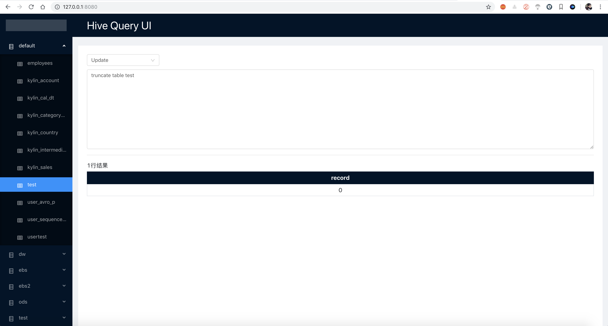

# hive-query

> hive可视化web系统

## 宗旨

一切为了好玩（Just For Fun）

## 展示



## 功能

* 展示数据库、表
* 查询（`select`、`show`、`desc`等）
* 更新（`insert`、`truncate`等）
* 执行（`create table`等）

## 快速入门

* 编译

```shell
hive-query> cd core
core> mvn package -DskipTests
```

* 执行

```shell
core> java -jar target/core-1.0.jar -Dspring.datasource.url=jdbc:hive2://172.16.242.185:15030/default
```

**注意**：这里`spring.datasource.url`替换为hive的thrift server的jdbc连接。

* 浏览器访问：`http://127.0.0.1:8080`。

## 原理

基于spring boot2.x，通过jdbc连接hive thrift server，最后进行可视化展示。

## 关于

### 前端

目前使用[nuxt](https://zh.nuxtjs.org/)随便弄了下，可自定义前端，替换`hive-query/core/src/main/resources/static`下的静态资源即可。

### hive jdbc

测试环境为HDP2.6.0，hive版本为1.2.1。

### spark jdbc

如果启动spark thrift server，替换`spring.datasource.url`连接信息也能支持jdbc访问spark。测试环境为HDP2.6.0，spark版本为2.1。

### 超时

如果SQL执行很久，会导致http超时，后面考虑用WebSocket，来处理SQL执行。